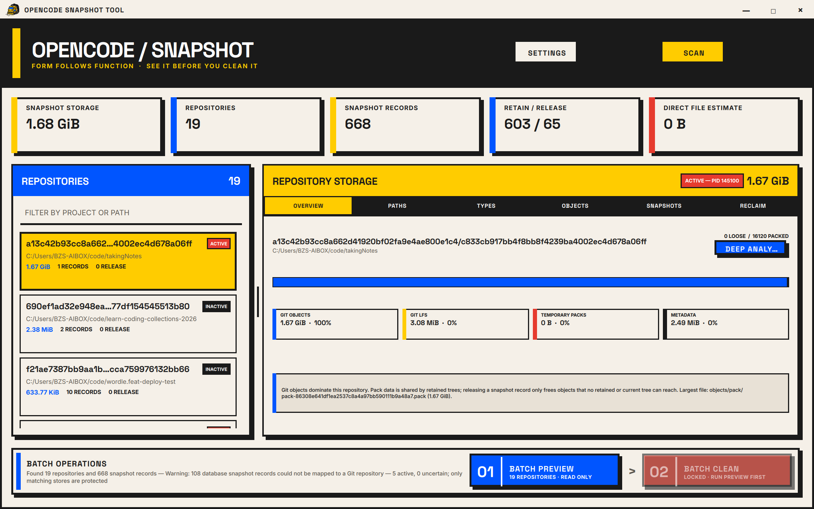

# OpenCode Snapshot Tool

A cross-platform Qt 6 desktop application for inspecting OpenCode snapshot storage and safely reclaiming unreachable Git and Git LFS data.



## What it does

- Scans both legacy and project/worktree snapshot layouts.
- Joins snapshot tree hashes to OpenCode session metadata from SQLite.
- Reports the actual logical bytes under the snapshot root, including Git packs, Git LFS, metadata, and temporary pack files.
- Deep-analyzes one repository into drillable current-tree paths, file types, largest blobs, pack files, protected history, and unprotected Git objects.
- Retains every snapshot seen within a configurable time window; if none are recent, retains the newest N trees per repository.
- Always protects the current Git index tree.
- Reports missing paths, database failures, and unmapped historical records without hiding partial results.
- Produces a read-only cleanup preview before enabling the cleanup action.
- Presents cleanup as an explicit two-step batch flow across all scanned repositories: batch preview first, then batch clean for the reviewed plan.
- Offers guarded per-project safe cleanup, current-state-only history reset, and full snapshot-store purge; every scope requires its own preview and confirmation.
- Protects retained trees with private refs before Git GC, fails closed on uncertain LFS reachability, and removes only stale temporary files.

The default paths are discovered from `OPENCODE_DATA_HOME`, `XDG_DATA_HOME`, or the platform's normal OpenCode data directory. Settings are editable and persisted locally.
Configurable cleanup options include the recent retention window, per-repository fallback count, full GC versus prune-only behavior, LFS pruning, and the stale temporary-file threshold.

The interface follows the Bauhaus / Neo-Brutalist system in [`design.md`](design.md): warm paper surfaces, solid geometry, thick borders, explicit high-contrast control colors, and fully custom application window chrome. Space Grotesk and Inter are bundled under the SIL Open Font License.

## Build

Requirements: CMake 3.24+, Ninja, a C++20 compiler, Git, and Qt 6.8+ (`Core`, `Sql`, `Concurrent`, `Quick`, `QuickControls2`, and `Widgets`). GoogleTest is fetched only when tests are enabled.

Windows (MSVC and Qt are discovered; set `QT_ROOT` to override):

```powershell
pwsh -NoProfile -File .\scripts\build.ps1 -Preset dev -Test
pwsh -NoProfile -File .\scripts\build.ps1 -Preset release -Deploy
pwsh -NoProfile -File .\scripts\package-windows.ps1 -Version 0.1.2
```

If the test dependency cannot be downloaded, the GUI can still be built independently:

```powershell
pwsh -NoProfile -File .\scripts\build.ps1 -Preset dev -WithoutTests -Deploy
```

Linux/macOS, with Qt discoverable through `CMAKE_PREFIX_PATH`:

```sh
./scripts/build.sh dev --test
```

Run the development application on Windows from `build/dev/opencode-snapshot-tool.exe`. On other platforms, the executable is under the corresponding preset build directory.

## Safety model

Scanning, deep analysis, and normal cleanup previews are read-only. The dedicated history-reset and full-purge previews additionally run `git write-tree` to prove that the live index is valid; this can materialize the current tree object inside the snapshot store but does not release objects or touch worktree files. Destructive execution is enabled only after its matching preview and confirmation dialog. Close OpenCode or ensure it is idle before cleanup. The retention age selects which snapshot trees are kept during preview. At execution, the tool protects those trees under `refs/opencode-snapshot-tool/keep/`, also protects the current index tree, and immediately prunes objects that are unreachable from every protected tree. Cleanup is destructive and cannot be undone from the application.

Snapshot records are Git trees, not independent full copies. Releasing a tree may reclaim little or no space when its objects are shared with retained trees. Deep analysis attributes packed Git blob bytes to their current-tree paths and separates the current state, retained history, and unprotected objects. Estimates remain estimates because Git may delta-compress and repack shared objects differently; the measured before/after result is authoritative.

The advanced history reset keeps the live index tree and the snapshot repository structure so OpenCode can create future snapshots, but old session Undo hashes for that project can stop working. Full-store purge removes the selected snapshot Git directory—including its live tree—while leaving the worktree and `opencode.db` untouched; OpenCode's snapshot initializer recreates a missing store on its next snapshot operation, but every old Undo hash for that store is lost. Both destructive modes require OpenCode to be closed, a short action-word confirmation (`RESET` or `PURGE`), no active Git lock files, and a dedicated preview. Full purge additionally canonicalizes the target and refuses any path outside the configured snapshot root. See [`docs/repository-analysis.md`](docs/repository-analysis.md) for the storage model and design rationale.

## Test strategy

The core was developed test-first. Twelve discovered tests cover retention boundaries, fallback quotas, current-index protection (including changes made after preview), directory discovery, exact filesystem sizing, actionable path warnings, real SQLite-to-Git tree mapping, distinct-session aggregation, deep Git-object reachability, lock refusal, root-bounded full purge, and end-to-end cleanup/reset/reinitialization behavior on isolated synthetic repositories. Real OpenCode data is used only for read-only scan, analysis, and preview validation.

Keyboard shortcuts: `Ctrl+,` opens settings, `Ctrl+P` starts a read-only batch cleanup preview, `Ctrl+1` through `Ctrl+6` select a repository detail page, `Ctrl+D` runs deep analysis, and `Ctrl+Shift+R` previews/reviews a selected-project history reset.
