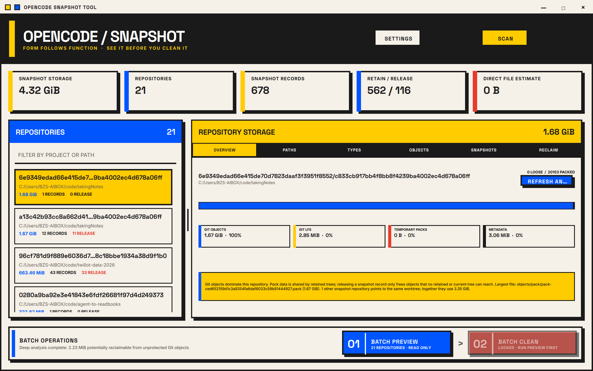
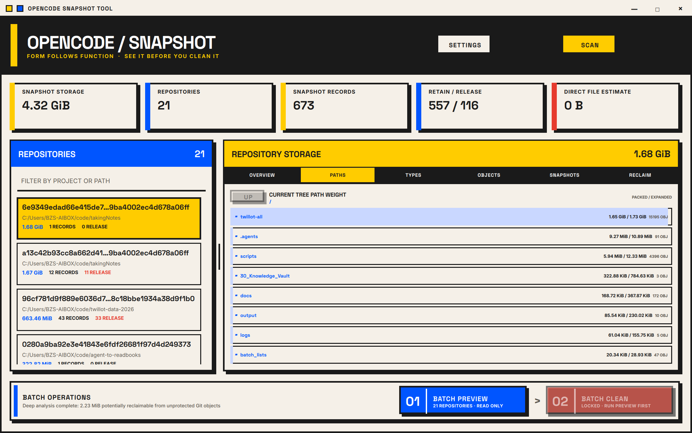
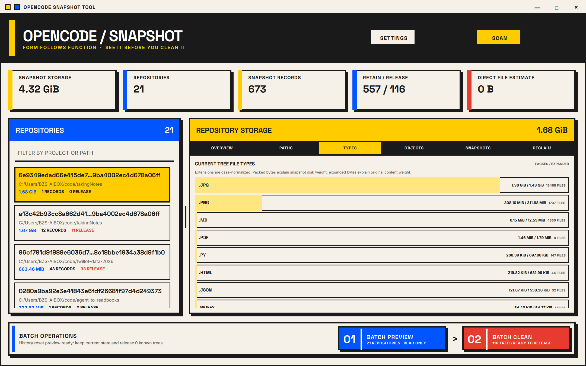
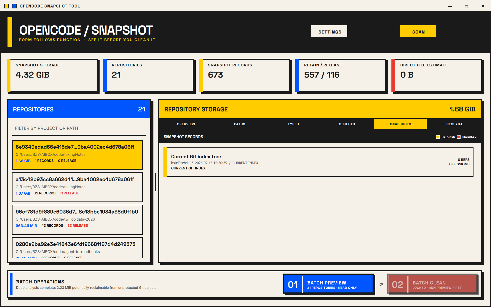
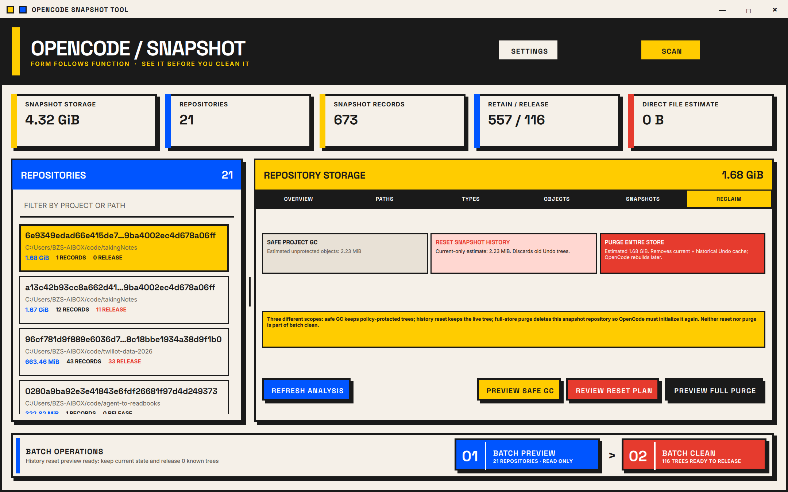
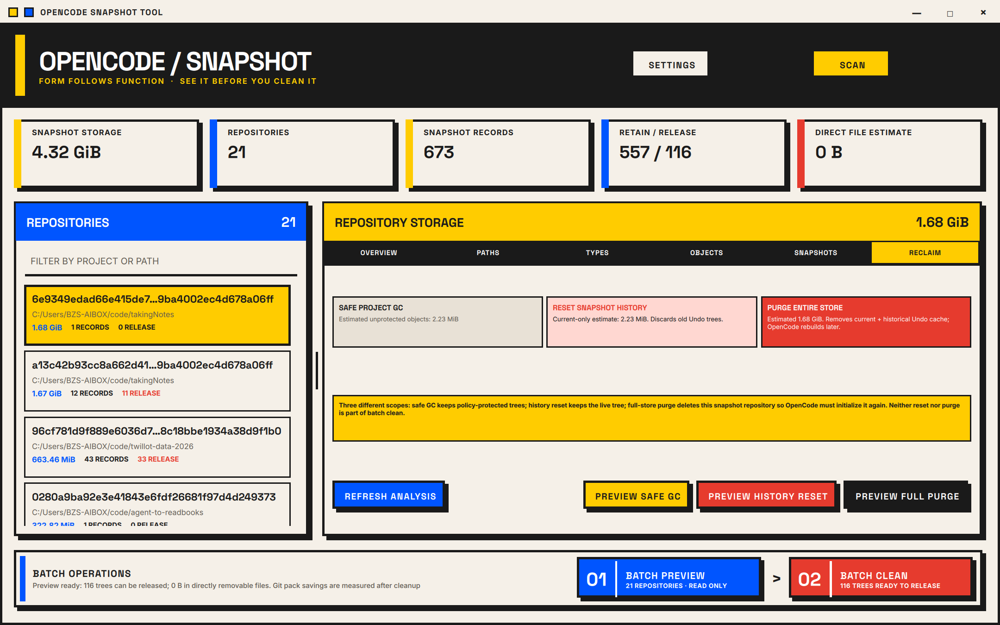
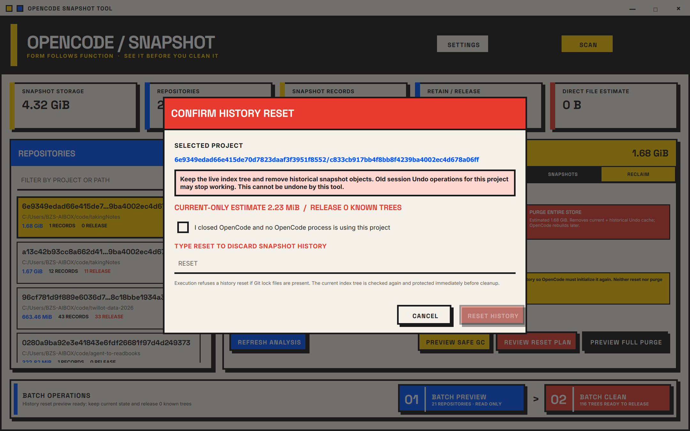

# OpenCode Snapshot Tool 变更实现报告

日期：2026-07-16  
开发分支：`feature/repository-storage-details`  
合并状态：Draft PR，尚未进入 `main`  

## 结论

本轮约定的功能已在开发分支实现，并完成重新构建与自动化验证。当前可以交给用户继续做真实数据和交互验收，但在用户明确确认前不应合并主干或发布 Release。

已确认：

- Qt 应用可完整构建并启动。
- 13/13 自动化测试通过。
- 真实 OpenCode 数据仅执行扫描、深度分析和清理预览，没有执行真实删除。
- 窗口在 150% DPI 下按当前屏幕可用区域自适应并居中，最终截图尺寸为 2160×1350。
- 主干未修改，所有变更仍位于 Draft PR 分支。

## 1. 新设计与应用窗口

界面已整体替换为 Bauhaus / Neo-Brutalist 风格：暖白底色、黑色粗边框、黄/红/蓝纯色块、无渐变、无柔和阴影，并使用应用自绘标题栏和窗口控制按钮。

窗口不再固定使用可能超出副屏的 `1440×900` 逻辑尺寸。启动时会根据当前屏幕可用区域缩放并居中，同时保留无边框自绘窗口。

## 2. Snapshot 实际占用空间

顶部的 `SNAPSHOT STORAGE` 统计 snapshot 根目录下各 Git snapshot store 的实际磁盘文件大小，不再把项目 worktree 大小当成 snapshot 占用。

单个仓库会进一步拆分为：

- Git objects：loose objects 与 pack 文件。
- Git LFS：snapshot store 内的 LFS 对象。
- Temporary packs：临时 pack、lock 等可识别文件。
- Metadata：index、refs、配置及其他仓库元数据。

截图中的实时结果为：snapshot 总占用 4.32 GiB；选中 store 实际占用 1.68 GiB，其中 Git objects 约 1.67 GiB、Git LFS 2.85 MiB、metadata 3.06 MiB。

## 3. 项目级空间解释

详情 Viewer 增加六个关联页面：Overview、Paths、Types、Objects、Snapshots、Reclaim。

### Paths：按目录逐层定位

深度分析会把 pack 中的 blob 映射回当前 snapshot tree 的项目路径，按 packed bytes 从大到小显示。目录可以继续下钻，文件可以跳转到对象列表。

### Types：按文件类型归因

扩展名会进行大小写归一，并同时显示压缩后的 packed bytes、原始 expanded bytes 和文件数。截图中的 1.68 GiB store 主要由 JPG（约 1.36 GiB packed）和 PNG（约 308.10 MiB packed）构成，因此它确实是当前 snapshot 内容较大，并非单纯的显示单位错误。

### Objects：按 Git 可达性解释

对象分析将 blob 分为：

- Current only：当前 live snapshot 仍然需要。
- Current + retained history：当前和保留历史共同需要。
- History only：只有保留历史需要。
- Unprotected：当前和保留历史都不再需要，可进入安全 GC 估算。

对象列表按 packed size 排序，并支持从目录或文件类型页面带入过滤条件。这样可以区分“项目当前内容本身很大”和“旧历史垃圾很多”两种完全不同的情况。

### Snapshots：保留与释放理由

快照页面显示当前 Git index tree、数据库 snapshot 记录、引用数、session 数、时间、来源，以及每条记录为什么保留或释放。

## 4. 三种项目清理范围

项目级 Reclaim 页面把三种语义不同的操作明确分开：

1. **Safe project GC**：保留当前 tree 和策略要求保留的 tree，只清理不再可达的 Git/LFS 数据。
2. **Reset snapshot history**：保留 live index tree，删除旧 Undo 历史；旧 session 的 Undo 可能失效。
3. **Purge entire store**：删除选中的整个 snapshot Git store，包括当前 snapshot 状态；不碰 worktree 和 `opencode.db`，OpenCode 后续会重新初始化 store。

截图中的 1.68 GiB store 只有约 2.23 MiB 是 unprotected 数据，因此 Safe GC 只能回收很少空间；如果目标是释放接近 1.68 GiB，需要明确选择 Full Store Purge，而不是把 1.68 GiB 错报为“安全可回收”。

## 5. 批量 Preview / Clean

批量操作采用两阶段流程：

- `01 Batch Preview` 只读计算全部仓库的保留/释放计划。
- `02 Batch Clean` 在 Preview 成功前保持锁定；Preview 失效或重新扫描后必须再次预览。

批量 Clean 只包含安全 GC，不包含 history reset 或 full-store purge。截图中的预览结果为 116 个 tree 可释放、直接文件估算 0 B；Git pack 的真实节省量只能在执行 GC 后测量，因此界面不会把 tree 逻辑大小伪装成即时磁盘回收量。

## 6. 危险操作确认体验

危险操作不再要求手抄完整项目哈希：

- History Reset 输入短词 `RESET`。
- Full Store Purge 输入短词 `PURGE`。
- 输入大小写不敏感，并忽略首尾空格。
- 项目标识仅展示，用于确认当前选择。

执行按钮仍要求同时完成“OpenCode 已关闭”勾选和短确认词输入。

## 7. 清理安全边界

实现保留了以下执行前保护：

- 每种项目操作必须先生成专用 Preview。
- Preview 期间切换项目会使结果失效。
- 执行前重新读取并验证 live index tree。
- 检测 Git lock 文件并拒绝清理。
- Safe GC 先创建私有保护 refs，再执行 prune/GC。
- Full Store Purge 对目标路径进行 canonicalize，并拒绝 snapshot 根目录之外的路径。
- Reset 和 Purge 不进入批量 Clean。
- Worktree 与 `opencode.db` 不属于删除目标。

## 8. 自动化验证

本轮重新执行 `ctest --test-dir build/dev --output-on-failure`，结果为 13/13 通过。覆盖范围包括：

- retention policy 与 current index tree 保护；
- legacy / two-level snapshot store 发现；
- Git objects、LFS、temporary packs、metadata 的实际目录计量；
- 数据库记录、tree 与 session 的映射；
- 项目 ID 迁移后，按相同 worktree 将旧 tree 映射回真实存在对象的 legacy store；
- current/history/unprotected packed object 分类；
- Preview 不写入；
- Safe GC 只保留计划 tree；
- History Reset 保留当前状态并允许未来 snapshot；
- Full Store Purge 的根目录边界，以及 OpenCode 后续重新初始化能力。

## 9. 尚需用户验收

代码实现和自动化验证已经完成，但以下事项仍需要用户在真实工作流中确认：

- 在常用显示器、缩放比例和多屏布局下检查字体、滚动与窗口拖拽体验。
- 对一份可丢弃的真实 snapshot store 执行 Safe GC，核对执行前后磁盘占用。
- 对一份可丢弃的真实 snapshot store 验证 Reset/Purge 后 OpenCode 的 Undo 行为和重新初始化行为。
- 用户确认后再将 Draft PR 标记为 Ready；在此之前不合并、不发布。
